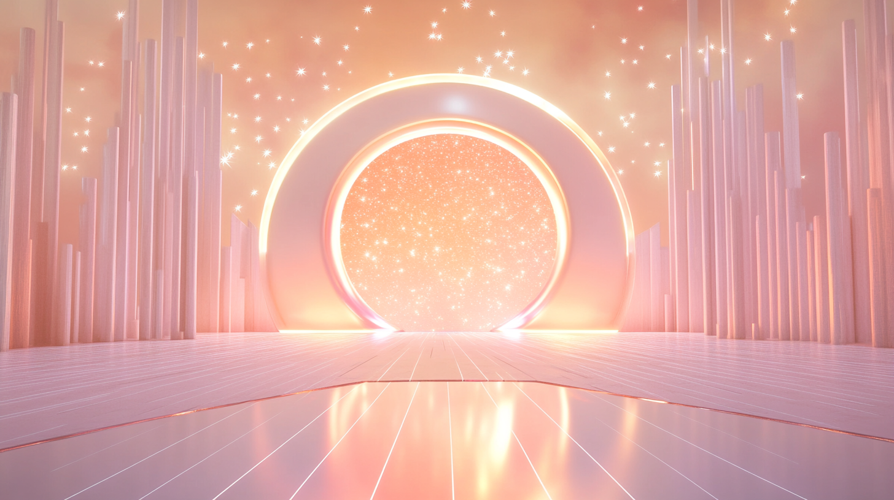

# Character Names Demo
Use ChatGPT and Midjourney to generate unique fonts and visualizations of character names.  Use Canva to pull them off any generated background.

## Start a new Chat

## Provide Context
Provide as much detail as you can about the character.  Ideally, upload images and documents as reference.

## Prompt
> Give me a prompt for an image of text for this character's name, styled appropriately for their background and personality. White background. 16:4 ar.

### Example Result
> The word "Bleepi" in a bold, futuristic rounded font, glowing light cyan with soft blue highlights, bubbly and playful typography, friendly and energetic tech aesthetic, slight drop shadow for depth, minimal accents like circuit lines or pixel sparkles, centered on a pure white background, ultra-clean design --ar 16:4

### Example Image (ChatGPT)

### Example Image (Midjourney)

# Character Slides Demo

We'll use the same approach as above, but change our language to produce a 16:9 slide background.  This time, we'll use the Prompt-By-Prompt method to generate a good prompt we can use in our character chats.

## Start a new Chat for Slide Backgrounds

## Initial Prompt (User-Provided)
> Give me a general ChatGPT prompt I can use in a character-specific chat that will generate me a good Midjourney prompt for a 16:9 slide.  Imagine a relatively neutral background that will thematically complement, and visually contrast with, the robots in a presentation.  Refer to the character in the prompt as "the current character", as we'll be running this in a character-specific chat.

## Generic Slide Prompt (ChatGPT-Generated)
> I'd like a Midjourney prompt for a 16:9 slide background that is thematically tailored to the current character. The background should visually contrast with the character's design while still complementing their role and personality. Please include color palette suggestions, texture or environmental motifs, and any abstract or symbolic elements that suit the character's conundrums or emotional tone. The final prompt should work well behind a robot in a presentation, be visually clean enough not to distract from foreground text, and reflect the character’s unique vibe. Output only the Midjourney prompt and nothing else.

## Open the Character-Specific Chat
Provide the prompt we just had GPT generate.

### Example Output
> Minimalist digital amphitheater with warm beige and coral lighting, subtle soft-focus spotlight in the center fading into off-white gradients, smooth curved architecture with faint iridescent overlays, translucent layers of concentric rings symbolizing attention and aspiration, ambient particle shimmer near the edges, matte texture floor with hints of pastel lavender reflections, abstract motif of an empty stage slightly elevated at the center back, symbolizing Bleepi’s quiet wish to be more than a host, visually clean and emotionally inviting, contrasts with cyan-white robotic palette while maintaining harmony --ar 16:9

## Generate an image from the prompt

### Example Image (ChatGPT)

### Example Image (Midjourney)

